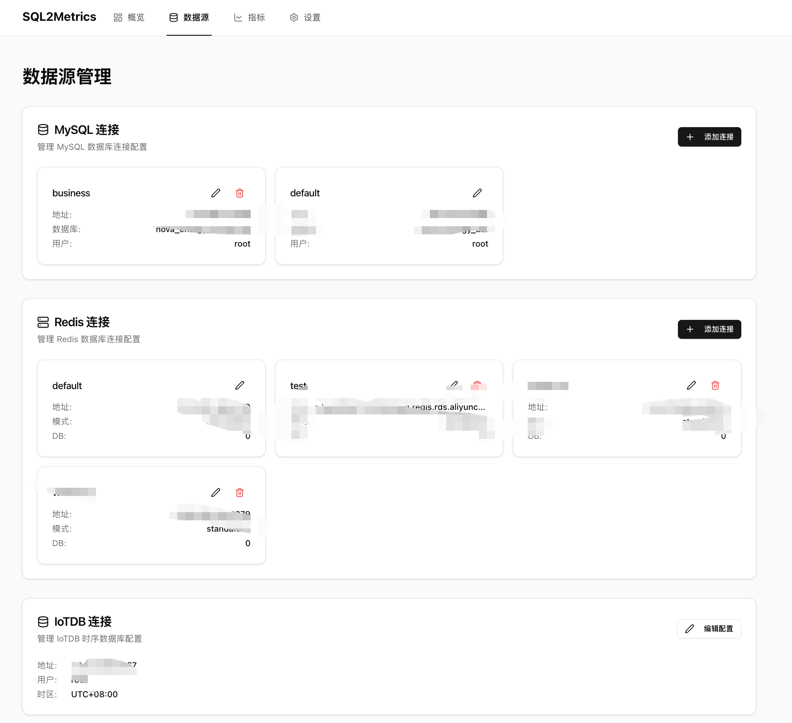
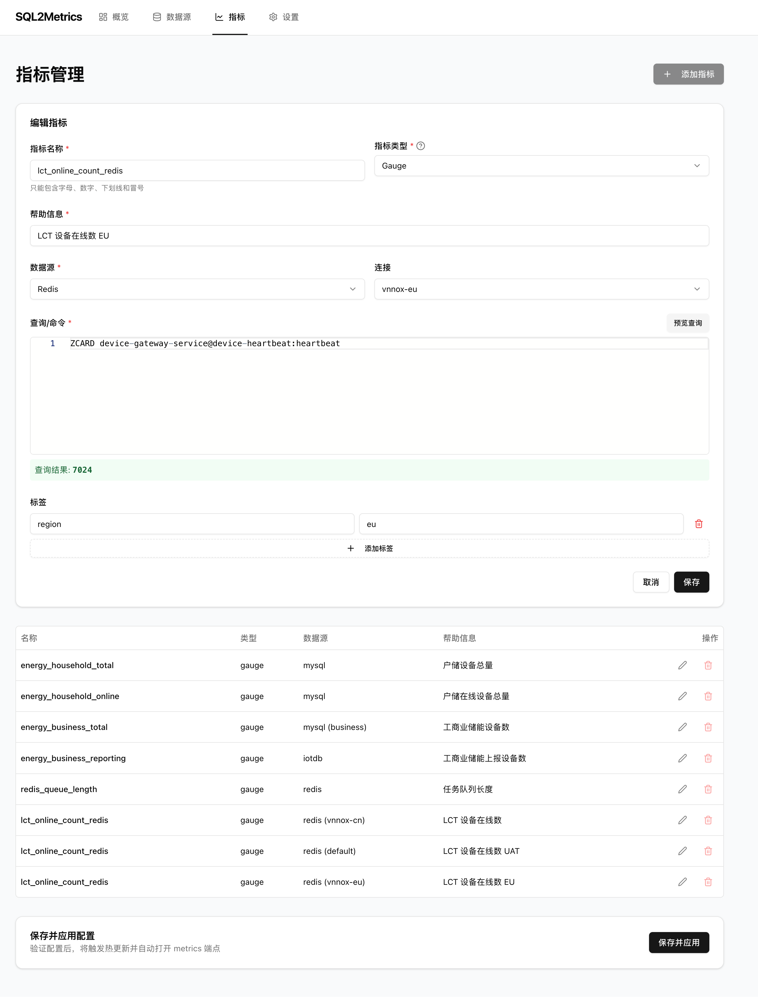

**SQL2Metrics** 是一款**零代码、配置驱动**的通用 Prometheus Exporter，并致力于进化为 **AI Native** 的智能可观测性平台。

它允许你通过简单的 **SQL 查询**或 **API 请求**，直接将业务数据转化为 Prometheus 监控指标。无需编写任何 Exporter 代码，只需在 Web 界面进行配置，即可将 **MySQL**、**Redis**、**IoTDB** 以及 **RESTful API** 的数据快速接入监控体系。

我们正在引入 **AI Copilot** 能力，未来你只需说出需求（如“监控订单异常”），系统将自动生成查询 SQL 与告警规则，实现真正的智能监控。

## 架构图


## 核心特性
- **配置驱动**：全部指标、SQL、连接信息通过 YAML 描述，新增监控无需改动代码。
- **多数据源支持**：同一进程内可连接多个 MySQL 数据库、Redis、IoTDB 与 RESTful API，按指标选择数据源。
- **Prometheus 兼容**：内置 HTTP Server 暴露指标，同时提供采集状态指标便于自监控。
- **Web UI 管理界面**：提供现代化的 Web 界面，支持可视化配置数据源和指标，一键保存并应用配置。
- **配置热更新**：支持动态重新加载配置和指标，无需重启服务。
- **安全性**：敏感凭据通过 `.env` 或环境变量注入，配置文件中仅保留占位符。

## 快速开始

### 方式一：使用 Web UI（推荐）

1. **安装依赖**：
   - 后端：要求 Go 1.21+
   - 前端：Node.js 18+ 和 npm/yarn

2. **配置凭据**：复制 `.env`（或创建新文件）填入 `MYSQL_USER`、`MYSQL_PASS`、`IOTDB_USER`、`IOTDB_PASS` 等敏感信息。

3. **启动后端服务**：
   ```bash
   go run ./cmd/collector -config configs/config.yml
   # 后端服务监听在 http://localhost:8080
   ```

4. **启动前端开发服务器**：
   ```bash
   cd web
   npm install
   npm run dev
   # 前端服务监听在 http://localhost:3000
   ```

5. **使用 Web UI**：
   - 打开浏览器访问 http://localhost:3000
   - 在 Web UI 中配置数据源和指标
   - 点击"保存并应用"按钮，配置会自动生效并打开 metrics 端点

### 方式二：直接编辑配置文件

1. 安装依赖：要求 Go 1.21+，并保证采集器所在机器可访问目标数据库。
2. 配置凭据：复制 `.env`（或创建新文件）填入 `MYSQL_USER`、`MYSQL_PASS`、`IOTDB_USER`、`IOTDB_PASS` 等敏感信息。
3. 编辑配置：修改 `configs/config.yml` 或单独创建环境专用文件，按需增删 `metrics` 项目。
4. 启动采集器：
   ```bash
   go run ./cmd/collector -config configs/config.yml
   # 浏览 http://localhost:8080/metrics 查看指标
   ```
5. 部署运行：可打包为容器镜像、以 systemd/Kubernetes CronJob 等方式运行，定时抓取 Prometheus 指标。

## 配置结构说明
- `schedule.interval`：采集周期，支持 `1h`、`30m` 等 Go duration 格式。
- `mysql_connections`：声明多个 MySQL 连接（可共用实例不同库），指标通过 `connection` 字段选择。
- `redis_connections`：声明多个 Redis 只读连接（目前支持 standalone），指标通过 `connection` 字段选择。
- `restapi_connections`：声明多个 RestAPI 连接（支持 Base URL、认证头等），指标通过 `connection` 字段选择。
- `iotdb`：配置 IoTDB 连接信息与会话参数；`result_field` 指定解析字段，若留空则自动选择首列。
- `metrics`：描述每个指标的名称、帮助信息、查询 SQL/API 路径、标签与数据源。
  - 支持指标类型：`gauge`、`counter`、`histogram`、`summary`
  - Histogram 类型需要配置 `buckets`
  - Summary 类型需要配置 `objectives`
  - RestAPI 数据源需指定 `query` (HTTP 方法与路径) 和 `result_field` (JSONPath)

## Web UI 功能

Web UI 提供了可视化的配置管理界面，包括：

- **可视化数据源管理**：直观地配置 MySQL、Redis、RestAPI 和 IoTDB 连接，内置一键连接测试。
- **交互式指标构建**：支持在线预览 SQL/API 查询结果，所见即所得地选择 JSON 字段生成指标。
- **无感热更新**：配置修改后自动触发平滑重载，业务零中断，无需重启服务。
- **一键预览应用**：配置完成后一键保存并生效，自动跳转 Metrics 端点验证数据。

### 界面预览

| 概览页面 | 数据源配置 |
|:---:|:---:|
|  |  |

| 连接测试 | 指标配置 |
|:---:|:---:|
|  |  |


## 指标约定与扩展
- 建议以业务域为前缀命名指标，例如 `sql2metrics_household_online`，标签使用小写英文。
- 同一指标可附加多标签（如 `region`、`category`），Prometheus 抓取后即可用于维度分析。
- 新增指标只需追加一段配置，无需重新编译或部署代码。
- Redis 数据源目前仅允许只读命令（GET/HGET/LLEN/SCARD/ZCARD/EXISTS 等），建议针对计数类 key 使用简单聚合命令，避免写操作与 Lua。
- RestAPI 支持 GET/POST 等方法，可解析复杂的 JSON 响应结构。

## 运行与排查
- 自监控指标：`collector_errors_total`（失败次数）、`collector_last_success_timestamp_seconds`（最近成功时间）。
- 日志：执行每个指标会输出查询 SQL/API 请求、执行耗时与结果，可快速定位慢查询或异常。
- 若发生连接失败或权限错误，请检查数据库连通性、账号权限、SQL/Redis 命令是否在目标环境可执行。

## 未来规划 (AI-Native Roadmap)

我们将 AI 视为可观测性的核心驱动力，致力于将 SQL2Metrics 进化为**智能化的数据观测 Agent**。

### 🤖 AI Copilot (配置助手)
- **Text-to-SQL/Metric**：输入自然语言（例如“监控每天订单量”），自动生成 SQL 查询和指标配置。
- **智能诊断**：自动分析 SQL 执行计划，优化查询性能，防止慢查询拖垮数据库。
- **配置自愈**：当数据源 Schema 变更导致查询由于字段缺失失败时，AI 自动尝试修正 SQL。

### 🧠 AIOps (智能运维)
- **无阈值异常检测**：内置轻量级算法，无需人工设置阈值，自动通过历史趋势发现数据异常（如突增、突降）。
- **根因分析 Agent**：当指标异常时，自动关联相关日志和事件，通过 LLM 生成分析报告。
- **智能告警降噪**：对 Prometheus 告警进行语义聚合，减少告警风暴，提供修复建议。

### 🔌 Agentic Interface (Agent 接口)
- **MCP (Model Context Protocol) 支持**：作为标准的 MCP Server，允许 Claude/ChatGPT 等顶级 AI 模型直接读取业务指标，回答复杂问题。
- **ChatBI 能力**：允许用户通过对话方式查询实时数据，生成临时图表。


