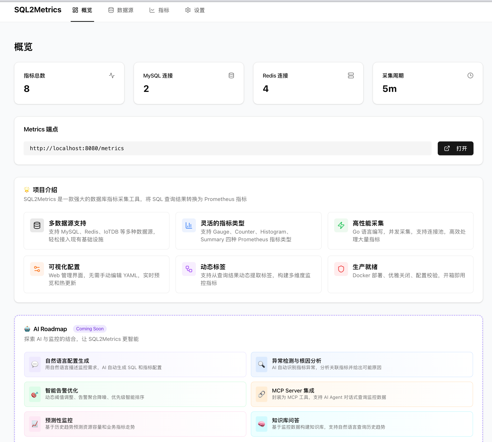
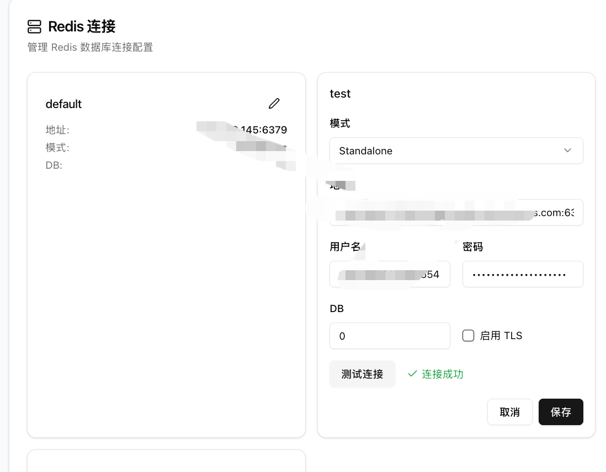

# sql2metrics

## 项目简介
sql2metrics 是一个以配置驱动的 Prometheus 指标采集器，能够定时执行数据库查询（当前支持MySQL、Redis 与 IoTDB），并将结果转换为 Prometheus Metrics 暴露在 `/metrics` 端点。适用于快速将现有业务 SQL 转换为可监控的时间序列，用于观察趋势、告警与容量分析。

## 架构图



## 核心特性
- **配置驱动**：全部指标、SQL、连接信息通过 YAML 描述，新增监控无需改动代码。
- **多数据源支持**：同一进程内可连接多个 MySQL 数据库、Redis 与 IoTDB，按指标选择数据源。
- **Prometheus 兼容**：内置 HTTP Server 暴露指标，同时提供采集状态指标便于自监控。
- **Web UI 管理界面**：提供现代化的 Web 界面，支持可视化配置数据源和指标，一键保存并应用配置。
- **配置热更新**：支持动态重新加载配置和指标，无需重启服务。
- **安全性**：敏感凭据通过 `.env` 或环境变量注入，配置文件中仅保留占位符。

## 快速开始

### 方式一：使用 Web UI（推荐）

1. **安装依赖**：
   - 后端：要求 Go 1.21+
   - 前端：Node.js 18+ 和 npm/yarn

2. **配置凭据**：复制 `.env`（或创建新文件）填入 `MYSQL_USER`、`MYSQL_PASS`、`IOTDB_USER`、`IOTDB_PASS` 等敏感信息。

3. **启动后端服务**：
   ```bash
   go run ./cmd/collector -config configs/config.yml
   # 后端服务监听在 http://localhost:8080
   ```

4. **启动前端开发服务器**：
   ```bash
   cd web
   npm install
   npm run dev
   # 前端服务监听在 http://localhost:3000
   ```

5. **使用 Web UI**：
   - 打开浏览器访问 http://localhost:3000
   - 在 Web UI 中配置数据源和指标
   - 点击"保存并应用"按钮，配置会自动生效并打开 metrics 端点

### 方式二：直接编辑配置文件

1. 安装依赖：要求 Go 1.21+，并保证采集器所在机器可访问目标数据库。
2. 配置凭据：复制 `.env`（或创建新文件）填入 `MYSQL_USER`、`MYSQL_PASS`、`IOTDB_USER`、`IOTDB_PASS` 等敏感信息。
3. 编辑配置：修改 `configs/config.yml` 或单独创建环境专用文件，按需增删 `metrics` 项目。
4. 启动采集器：
   ```bash
   go run ./cmd/collector -config configs/config.yml
   # 浏览 http://localhost:8080/metrics 查看指标
   ```
5. 部署运行：可打包为容器镜像、以 systemd/Kubernetes CronJob 等方式运行，定时抓取 Prometheus 指标。

## 配置结构说明
- `schedule.interval`：采集周期，支持 `1h`、`30m` 等 Go duration 格式。
- `mysql_connections`：声明多个 MySQL 连接（可共用实例不同库），指标通过 `connection` 字段选择。
- `redis_connections`：声明多个 Redis 只读连接（目前支持 standalone），指标通过 `connection` 字段选择。
- `iotdb`：配置 IoTDB 连接信息与会话参数；`result_field` 指定解析字段，若留空则自动选择首列。
- `metrics`：描述每个指标的名称、帮助信息、查询 SQL、标签与数据源。
  - 支持指标类型：`gauge`、`counter`、`histogram`、`summary`
  - Histogram 类型需要配置 `buckets`
  - Summary 类型需要配置 `objectives`

## Web UI 功能

Web UI 提供了可视化的配置管理界面，包括：

- **数据源管理**：可视化配置 MySQL 和 IoTDB 连接，支持连接测试
- **指标管理**：创建、编辑、删除指标，支持 SQL 查询预览
- **配置热更新**：保存配置后自动触发热更新，无需重启服务
- **一键应用**：配置完成后一键保存并应用，自动打开 metrics 端点查看效果

### 界面预览

| 概览页面 | 数据源配置 |
|:---:|:---:|
|  |  |

| 连接测试 | 指标配置 |
|:---:|:---:|
|  |  |


## 指标约定与扩展
- 建议以业务域为前缀命名指标，例如 `sql2metrics_household_online`，标签使用小写英文。
- 同一指标可附加多标签（如 `region`、`category`），Prometheus 抓取后即可用于维度分析。
- 新增指标只需追加一段配置，无需重新编译或部署代码。
- Redis 数据源目前仅允许只读命令（GET/HGET/LLEN/SCARD/ZCARD/EXISTS 等），建议针对计数类 key 使用简单聚合命令，避免写操作与 Lua。

## 运行与排查
- 自监控指标：`collector_errors_total`（失败次数）、`collector_last_success_timestamp_seconds`（最近成功时间）。
- 日志：执行每个指标会输出查询 SQL、执行耗时与结果，可快速定位慢查询或异常。
- 若发生连接失败或权限错误，请检查数据库连通性、账号权限、SQL/Redis 命令是否在目标环境可执行。

## 下一步规划
- 扩展更多数据源（如 PostgreSQL、REST API）。
- 引入插件式聚合函数，支持对结果做平均、环比等计算。
- 集成 CI/CD 与自动化测试覆盖更多配置场景。
- Web UI 增强：添加 API 认证机制、深色模式支持、Metrics 预览功能。


