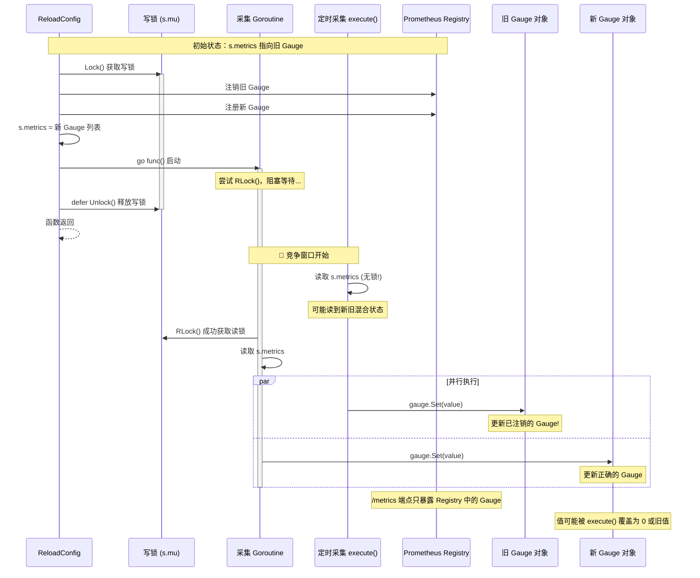
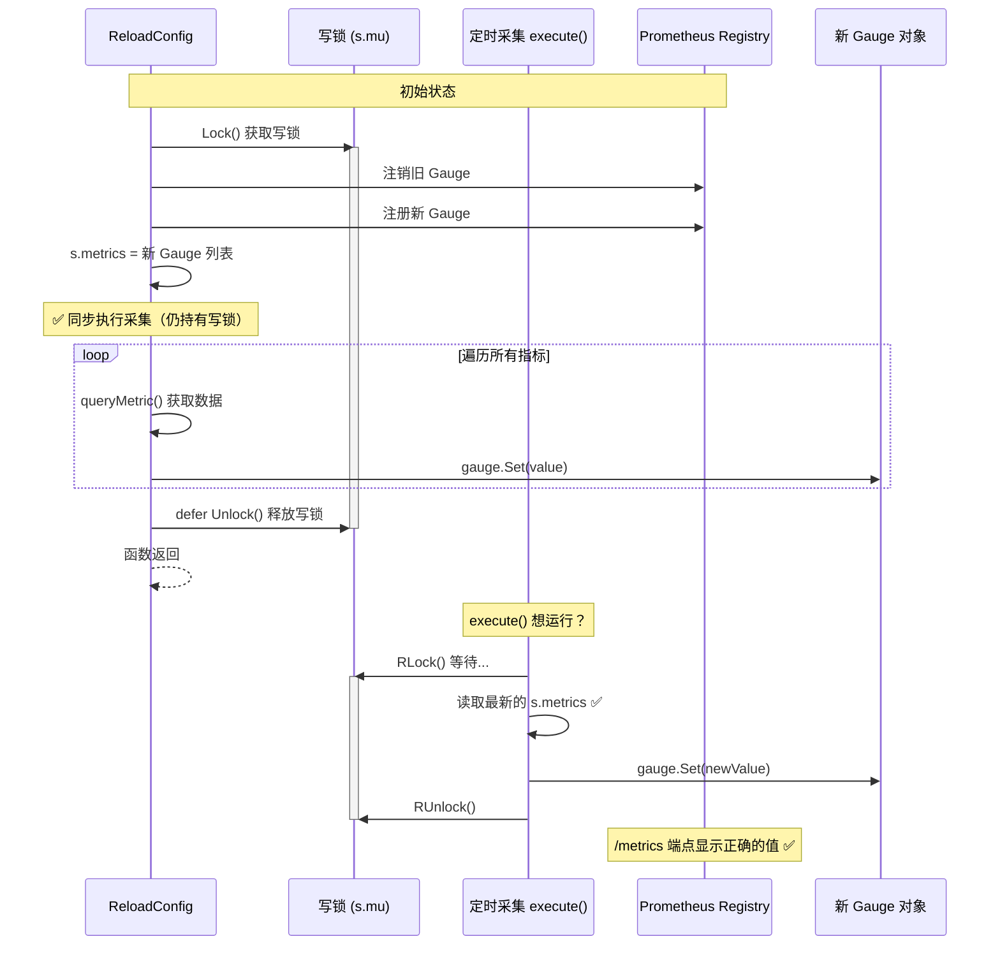

# Go 并发与 Prometheus 指标注册：两个典型问题分析

本文档总结了在 sql2metrics 项目开发过程中遇到的两个典型问题，涉及 Go 语言的并发控制和 Prometheus 客户端库的使用。

---

## 问题一：Goroutine 异步执行与锁竞争

### 问题现象

热更新配置后，日志显示指标采集成功并获取到了正确的值，但通过 `/metrics` 端点查询时所有指标值都是 0。

```
2025/12/17 17:01:46 热更新采集指标 lct_online_count_redis 成功，值=3509.000
```

但 `/metrics` 显示：
```
lct_online_count_redis{region="cn"} 0
```

### 问题根因

使用 goroutine 异步执行采集时，存在竞争条件。下面用时序图展示问题发生的过程：

#### 问题时序图（异步 Goroutine 方案）



#### 正确时序图（同步执行方案）



#### 关键问题代码

```go
func (s *Service) ReloadConfig(newCfg *config.Config) ReloadResult {
    s.mu.Lock()
    defer s.mu.Unlock()
    
    // ... 注册新的 gauge 到 registry ...
    s.metrics = updatedMetrics
    
    // ❌ 问题代码：异步 goroutine
    go func() {
        s.mu.RLock()           // 阻塞！等待写锁释放
        metrics := s.metrics
        s.mu.RUnlock()
        
        for _, holder := range metrics {
            value, _ := s.queryMetric(ctx, holder.spec)
            holder.gauge.Set(value)  // 更新 gauge
        }
    }()
    
    return result  // 返回后才释放写锁
}
```

**问题分析**：

1. `ReloadConfig` 持有写锁 `s.mu.Lock()`
2. 启动 goroutine，但 goroutine 阻塞在 `s.mu.RLock()` 等待写锁释放
3. `ReloadConfig` 返回，`defer` 释放写锁
4. **此时**，定时采集的 `execute` 方法（没有锁保护）可能同时运行
5. `execute` 使用的是旧的 `s.metrics` 副本（热更新前的数据）
6. 导致 goroutine 更新的是新 gauge，但 `execute` 更新的是旧 gauge

### Go 语言知识点

#### 1. defer 的执行时机

```go
func example() {
    mu.Lock()
    defer mu.Unlock()  // 在 return 语句之后、函数返回之前执行
    
    go func() {
        // 这个 goroutine 启动时，锁还没释放
        // 如果尝试获取锁，会阻塞
    }()
    
    return  // 先执行 return，再执行 defer mu.Unlock()
}
```

#### 2. 切片复制的陷阱

```go
metrics := s.metrics  // 只复制了切片头部（指针、长度、容量）

// 正确的深拷贝方式：
metrics := make([]metricHolder, len(s.metrics))
copy(metrics, s.metrics)
```

#### 3. 读写锁的特性

```go
var mu sync.RWMutex

// 写锁：独占访问，阻塞所有其他锁请求
mu.Lock()
defer mu.Unlock()

// 读锁：共享访问，多个读锁可以同时持有
mu.RLock()
defer mu.RUnlock()
```

### 正确的解决方案

**方案一：同步执行（推荐）**

```go
func (s *Service) ReloadConfig(newCfg *config.Config) ReloadResult {
    s.mu.Lock()
    defer s.mu.Unlock()
    
    // ... 注册新的 gauge ...
    s.metrics = updatedMetrics
    
    // ✅ 同步执行采集，在锁保护下完成
    for _, holder := range s.metrics {
        value, _ := s.queryMetric(ctx, holder.spec)
        holder.gauge.Set(value)
    }
    
    return result
}
```

**方案二：为所有访问 s.metrics 的地方加锁**

```go
func (s *Service) execute(ctx context.Context) {
    // ✅ 获取锁并复制
    s.mu.RLock()
    metrics := make([]metricHolder, len(s.metrics))
    copy(metrics, s.metrics)
    s.mu.RUnlock()
    
    // 使用复制的切片进行采集
    for _, holder := range metrics {
        // ...
    }
}
```

---

## 问题二：Prometheus 自定义注册表缺失内置指标

### 问题现象

从全局默认注册表切换到自定义注册表后，Go runtime 的内置监控指标消失了：

- `go_goroutines` - 当前 goroutine 数量
- `go_gc_duration_seconds` - GC 耗时
- `go_memstats_*` - 内存统计
- `process_*` - 进程指标

### 问题根因

#### 全局默认注册表 vs 自定义注册表

```go
// 方式一：使用全局默认注册表（自动包含内置 collector）
prometheus.MustRegister(myGauge)
http.Handle("/metrics", promhttp.Handler())

// 方式二：使用自定义注册表（空的，没有内置 collector）
registry := prometheus.NewRegistry()
registry.MustRegister(myGauge)
http.Handle("/metrics", promhttp.HandlerFor(registry, promhttp.HandlerOpts{}))
```

全局默认注册表 `prometheus.DefaultRegistry` 在初始化时会自动注册：
- `prometheus.NewGoCollector()` - Go runtime 指标
- `prometheus.NewProcessCollector(...)` - 进程指标

自定义注册表 `prometheus.NewRegistry()` 是空的，需要手动注册这些 collector。

### Prometheus 客户端库知识点

#### 1. 两种注册表的区别

| 特性 | 全局默认注册表 | 自定义注册表 |
|------|--------------|-------------|
| 创建方式 | 自动存在 | `prometheus.NewRegistry()` |
| 内置 collector | 自动包含 | 需手动注册 |
| 注册方法 | `prometheus.Register()` | `registry.Register()` |
| Handler | `promhttp.Handler()` | `promhttp.HandlerFor(registry, ...)` |
| 隔离性 | 全局共享 | 独立隔离 |

#### 2. 为自定义注册表添加内置 collector

```go
registry := prometheus.NewRegistry()

// 注册 Go runtime 指标
registry.MustRegister(prometheus.NewGoCollector())

// 注册进程指标
registry.MustRegister(prometheus.NewProcessCollector(prometheus.ProcessCollectorOpts{}))

// 注册自定义指标
registry.MustRegister(myGauge)
```

#### 3. 为什么使用自定义注册表？

- **隔离性**：避免与其他库注册的指标冲突
- **可控性**：精确控制暴露哪些指标
- **测试友好**：每个测试可以使用独立的注册表
- **热更新支持**：可以动态注册/注销指标

### 正确的实现

```go
func NewService(cfg *config.Config) (*Service, error) {
    svc := &Service{
        registry: prometheus.NewRegistry(),
    }
    
    // ✅ 注册内置 collector
    svc.registry.MustRegister(prometheus.NewGoCollector())
    svc.registry.MustRegister(prometheus.NewProcessCollector(prometheus.ProcessCollectorOpts{}))
    
    // 注册自定义指标...
    return svc, nil
}

func (s *Service) GetPrometheusHandler() http.Handler {
    // ✅ 使用自定义注册表
    return promhttp.HandlerFor(s.registry, promhttp.HandlerOpts{
        EnableOpenMetrics: true,
    })
}
```

---

## 总结

### 并发编程要点

1. **锁的粒度**：尽量缩小临界区，但要确保数据一致性
2. **避免在持有锁时启动需要获取同一锁的 goroutine**
3. **切片是引用类型**：赋值只复制头部，需要 `copy()` 进行深拷贝
4. **defer 在 return 之后执行**：理解执行顺序对于锁管理至关重要

### Prometheus 使用要点

1. **自定义注册表更灵活**：支持热更新场景下的指标动态管理
2. **内置 collector 需手动注册**：`NewGoCollector()` 和 `NewProcessCollector()`
3. **Handler 要匹配注册表**：`promhttp.Handler()` vs `promhttp.HandlerFor(registry, ...)`

---

## 相关代码文件

- [service.go](../internal/collectors/service.go) - 采集服务核心实现
- [handlers.go](../internal/api/handlers.go) - API 处理器

## 参考资料

- [Go sync 包文档](https://pkg.go.dev/sync)
- [Prometheus Go 客户端库](https://pkg.go.dev/github.com/prometheus/client_golang/prometheus)
- [Effective Go - Concurrency](https://go.dev/doc/effective_go#concurrency)
